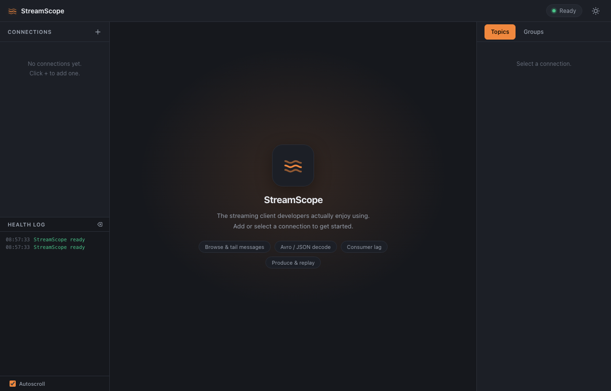

<div align="center">

# 🌊 StreamScope

**The Kafka desktop client developers actually enjoy using.**

Fast · native · beautiful · local-first — think *TablePlus, but for Kafka*.

[](https://github.com/thangvv2704/streamscope/releases)
[](https://github.com/thangvv2704/streamscope/releases)
[](./LICENSE)
[](https://github.com/thangvv2704/streamscope/actions)

[English](#-english) · [Tiếng Việt](#-tiếng-việt) · [中文](#-中文) · [⬇ Download](https://github.com/thangvv2704/streamscope/releases)

<!-- Add a screenshot/GIF here for maximum impact:
      -->

</div>

---

## 🇬🇧 English

### What is it?

A fast, native desktop app to browse Apache Kafka: view topics, read & filter
messages (pretty JSON + Avro/JSON-Schema decode), produce & replay, and check
consumer lag. No cloud account, no data leaves your machine.

### Install (easiest)

**Option A — Download the app (recommended)**

1. Go to the [Releases page](https://github.com/thangvv2704/streamscope/releases).
2. Download the file for your OS:
   - **macOS** → `.dmg`
   - **Windows** → `.msi` or `.exe`
   - **Linux** → `.AppImage` or `.deb`
3. Open it and drag StreamScope to Applications (macOS) or run the installer.
4. Launch **StreamScope**, click **+**, enter your broker (e.g. `localhost:9092`),
   press **Test**, then **Save & Connect**. Done! 🎉

> macOS note: on first launch, right-click the app → **Open** to bypass Gatekeeper
> if the build isn't notarized yet.

**Option B — Build from source**

Requirements: [Node.js](https://nodejs.org) + [pnpm](https://pnpm.io),
[Rust](https://rustup.rs), and **CMake** (librdkafka builds from source, so no
system Kafka library is needed).

```bash
# 1. Install CMake
#    macOS:   brew install cmake
#    Ubuntu:  sudo apt-get install -y cmake build-essential
#    Windows: winget install Kitware.CMake

# 2. Clone & install
git clone https://github.com/thangvv2704/streamscope.git
cd streamscope
pnpm install

# 3. Run (dev)
pnpm tauri dev

# 4. Build a distributable app
pnpm tauri build
```

### Try it with a local Kafka

No cluster handy? Spin one up with Docker and connect to `localhost:9092`:

```bash
docker compose -f docker-compose.dev.yml up -d   # or: docker-compose -f ...
```

### Features
Multiple connections (SASL/SSL) · **Kafka & Redis** (RabbitMQ/NATS coming) ·
topic/key search & favorites · message viewer with JSON syntax highlighting ·
Avro / JSON / Protobuf decode · produce, replay & templates · consumer-group lag ·
dark / light themes.

---

## 🇻🇳 Tiếng Việt

### StreamScope là gì?

Ứng dụng desktop nhanh, gọn để làm việc với Apache Kafka: xem topic, đọc & lọc
message (JSON tô màu + giải mã Avro/JSON-Schema), gửi & phát lại message, xem độ
trễ (lag) của consumer. Không cần tài khoản cloud, dữ liệu không rời khỏi máy bạn.

### Cài đặt (đơn giản nhất)

**Cách A — Tải app về dùng (khuyên dùng)**

1. Vào trang [Releases](https://github.com/thangvv2704/streamscope/releases).
2. Tải file theo hệ điều hành của bạn:
   - **macOS** → `.dmg`
   - **Windows** → `.msi` hoặc `.exe`
   - **Linux** → `.AppImage` hoặc `.deb`
3. Mở file: kéo StreamScope vào Applications (macOS) hoặc chạy trình cài đặt.
4. Mở **StreamScope**, bấm **+**, nhập broker (vd `localhost:9092`), bấm **Test**,
   rồi **Save & Connect**. Xong! 🎉

> Lưu ý macOS: lần đầu mở, nếu báo chặn thì chuột phải vào app → **Open** để bỏ qua
> Gatekeeper (khi bản build chưa được notarize).

**Cách B — Tự build từ mã nguồn**

Cần: [Node.js](https://nodejs.org) + [pnpm](https://pnpm.io),
[Rust](https://rustup.rs), và **CMake** (librdkafka được build từ nguồn nên
không cần cài thư viện Kafka hệ thống).

```bash
# 1. Cài CMake
#    macOS:   brew install cmake
#    Ubuntu:  sudo apt-get install -y cmake build-essential
#    Windows: winget install Kitware.CMake

# 2. Clone & cài dependency
git clone https://github.com/thangvv2704/streamscope.git
cd streamscope
pnpm install

# 3. Chạy thử (dev)
pnpm tauri dev

# 4. Đóng gói app để phân phối
pnpm tauri build
```

### Tính năng
Nhiều kết nối (SASL/SSL) · tìm topic & đánh dấu yêu thích · xem message với JSON
tô màu · giải mã Avro / JSON / Protobuf · gửi, phát lại & lưu template message · xem
lag consumer group · giao diện sáng / tối.

---

## 🇨🇳 中文

### 这是什么？

一个快速、原生的 Apache Kafka 桌面客户端：浏览 topic、读取与过滤消息（JSON 语法高亮
+ Avro/JSON-Schema 解码）、发送与重放消息、查看消费者延迟（lag）。无需云账号，数据不
离开本机。

### 安装（最简单）

**方式 A — 下载应用（推荐）**

1. 打开 [Releases 页面](https://github.com/thangvv2704/streamscope/releases)。
2. 根据系统下载对应文件：
   - **macOS** → `.dmg`
   - **Windows** → `.msi` 或 `.exe`
   - **Linux** → `.AppImage` 或 `.deb`
3. 打开文件：macOS 把 StreamScope 拖入「应用程序」，或运行安装程序。
4. 启动 **StreamScope**，点击 **+**，填入 broker（如 `localhost:9092`），点 **Test**，
   再点 **Save & Connect**。完成！🎉

> macOS 提示：首次打开若被拦截，右键点应用 → **打开**，即可绕过 Gatekeeper
> （当构建尚未 notarize 时）。

**方式 B — 从源码构建**

需要：[Node.js](https://nodejs.org) + [pnpm](https://pnpm.io)、
[Rust](https://rustup.rs) 和 **CMake**（librdkafka 从源码构建，无需安装系统 Kafka 库）。

```bash
# 1. 安装 CMake
#    macOS：  brew install cmake
#    Ubuntu： sudo apt-get install -y cmake build-essential
#    Windows：winget install Kitware.CMake

# 2. 克隆并安装依赖
git clone https://github.com/thangvv2704/streamscope.git
cd streamscope
pnpm install

# 3. 运行（开发模式）
pnpm tauri dev

# 4. 构建可分发的应用
pnpm tauri build
```

### 功能
多连接（SASL/SSL）· topic 搜索与收藏 · 带 JSON 语法高亮的消息查看 · Avro / JSON / Protobuf
解码 · 发送、重放与消息模板 · 消费者组 lag · 深色 / 浅色主题。

---

<div align="center">

Built with **Tauri (Rust)** + **React** · local-first · tiny native binary

For packaging, code-signing & auto-update, see
[DISTRIBUTION.md](./DISTRIBUTION.md).

</div>
